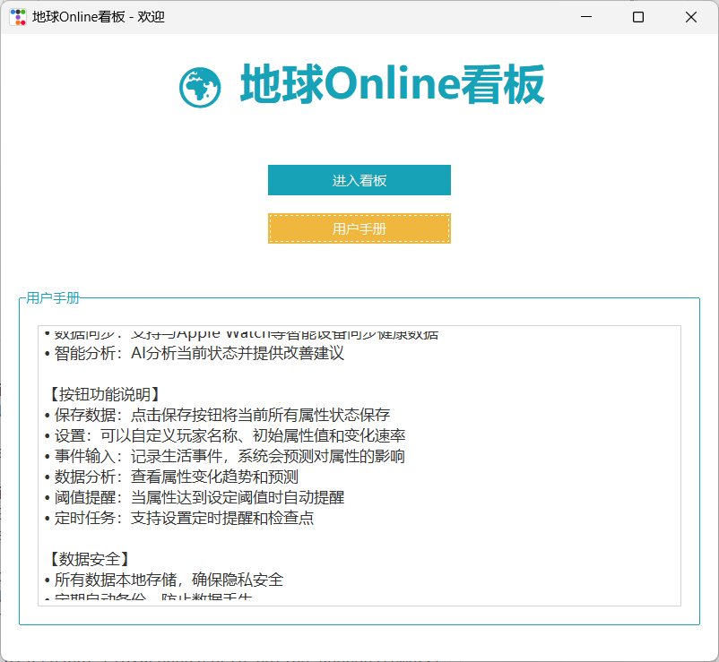
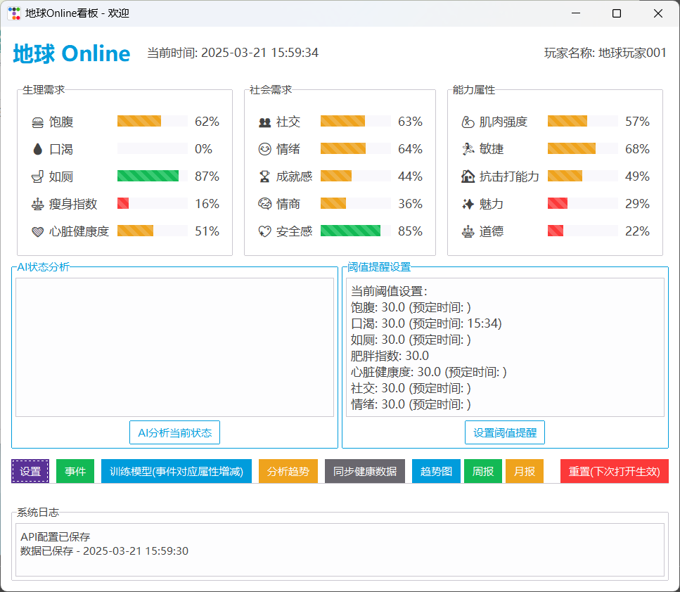
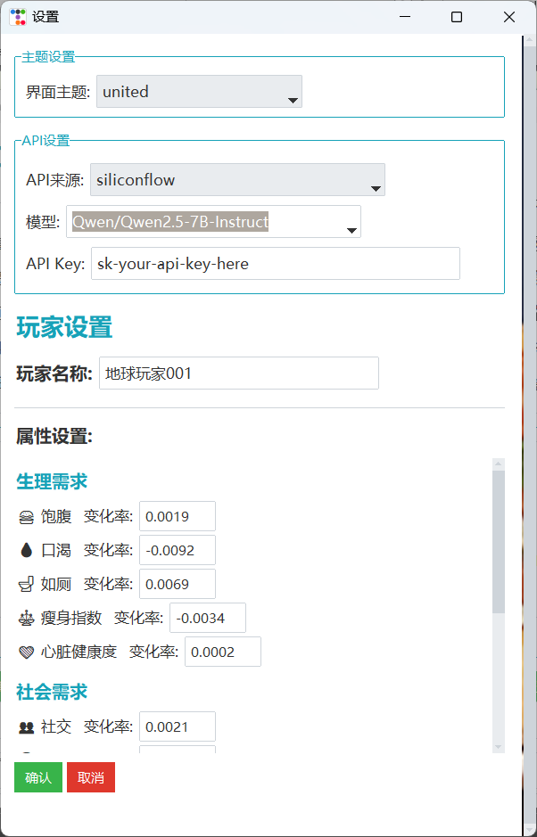
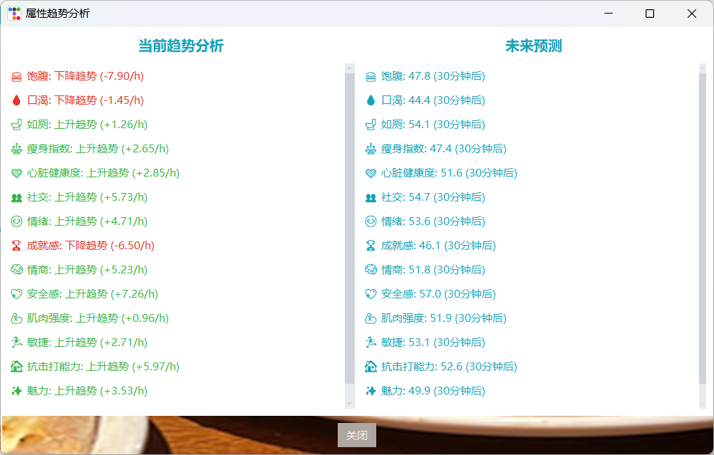
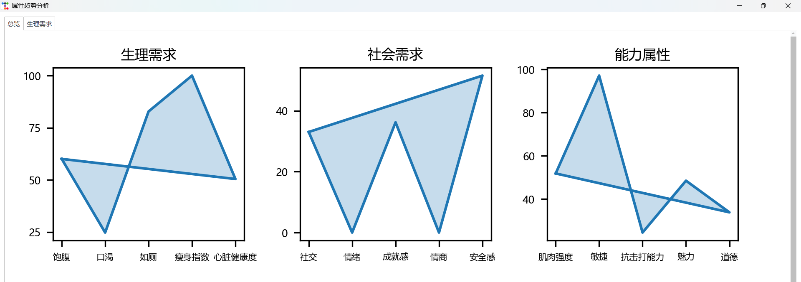
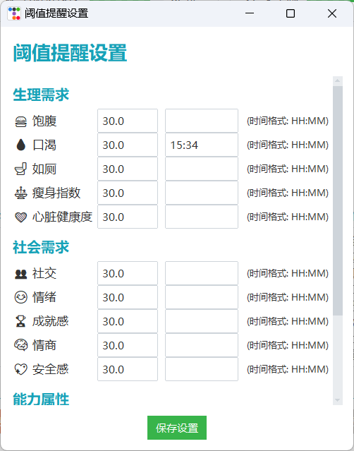
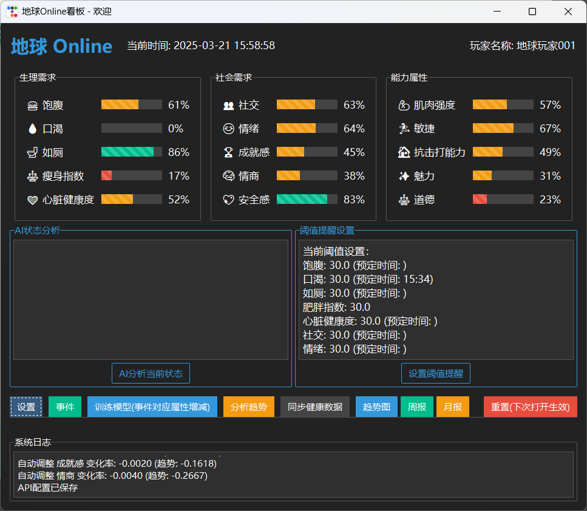

# 🌍 地球Online 看板 Earth-Online Kanban

<!--  -->

<i>【地球Online看板】系统已绑定，宿主您当前的属性值是.......</i>

关键词： **自我监控** **健康管理** **动机激励** **智能穿戴集成** **数据分析** **AI助手**

🌍 地球 Online 电脑桌面看板应用，可视化和跟踪【人类您】的日常生活中的各种属性状态，帮助你以游戏化的方式，更加量化地监控自己的生活状态。

## 效果图

主页：

<p align="center">
  
</p>

看板：

<p align="center">
  
</p>

事件：

<p align="center">
  
</p>


设置界面：

<p align="center">
  
</p>

趋势文字描述：

<p align="center">
  
</p>

趋势多维展示描述：

<p align="center">
  
</p>


阈值提醒设置：

<p align="center">
  
</p>


看板主题颜色设置后（还有许多主题可选）：

<p align="center">
  
</p>


## 功能特点

- **全新主页**：美观的欢迎页面，包含进入看板和用户手册功能
- **简洁**的游戏风格界面，分类显示不同属性
- 进度条**不同颜色**（红色=危险，黄色=警告，绿色=健康）
- 多种属性状态**实时更新**，模拟真实生活状态的波动，自定义属性变化速率
- 可**自定义**玩家名称和初始属性值
- **保存和加载**玩家数据
- **智能穿戴集成**：自动同步Apple Watch/健康数据，实时更新相关属性
- **AI分析**：通过大模型API分析当前状态并给出建议
- **事件系统**：支持输入生活事件，通过机器学习预测对属性的影响
- **趋势分析**：自动分析属性变化趋势，预测未来状态
- **阈值提醒**：当属性达到设定阈值时自动提醒
- **定时任务**：支持设置定时提醒和检查点
- **数据可视化**：支持生成周报和月报，包含详细的数据分析和图表
- **PDF导出**：支持将报告导出为PDF格式
- **系统日志**：自动记录系统运行日志，方便追踪和调试
- **主题设置**：支持自定义界面主题和背景
- 非常**轻量级**，只需要运行单个 python 文件
- 本地运行，内容**安全**

## 属性列表

地球Online看板跟踪以下三大类15种属性：（未来必然会添加更多，分类也更加完善）

| 类别 | 属性 | 图标 | 数据来源 |
|------|------|------|----------|
| **生理需求** | 饥饿 | 🍔 | 手动输入 |
| | 口渴 | 💧 | 手动输入 |
| | 上厕所 | 🚽 | 手动输入 |
| | 肥胖指数 | ⚖️ | 健康数据 |
| | 心脏健康度 | ❤️ | 健康数据 |
| **情感状态** | 社交欲望 | 👥 | 手动输入 |
| | 情绪 | 😊 | 手动输入 |
| | 成就感 | 🏆 | 手动输入 |
| | 情商 | 🧠 | 手动输入 |
| | 爱心 | 💖 | 手动输入 |
| **能力属性** | 肌肉强度 | 💪 | 健康数据 |
| | 敏捷 | 🏃 | 健康数据 |
| | 抗击打能力 | 🛡️ | 手动输入 |
| | 魅力 | ✨ | 手动输入 |
| | 道德 | ⚖️ | 手动输入 |

## 健康数据集成

应用程序现已支持与Apple健康数据的集成，可以自动同步以下数据：

- **步数**：影响敏捷属性（10000步/天 = 100分）
- **心率**：影响心脏健康度（接近理想心率75时分数最高）
- **体重**：影响肥胖指数（基于BMI计算）
- **运动消耗**：影响肌肉强度（3000卡路里/天 = 100分）

数据每5分钟自动同步一次，确保属性值始终反映您的实际健康状态。

## 快速启动

1. 克隆此仓库：

```bash
git clone https://github.com/JyiDeng/earth-online-kanban.git
cd earth-online-kanban
```

2. 安装依赖：

```bash
pip install -r requirements.txt
```

3. 如果要使用健康数据集成功能：
   - 将Apple健康数据导出文件放在 `WatchData/apple_health_export/` 目录下
   - 确保导出文件命名为 `export.xml`

4. 执行以下命令启动应用程序：

```bash
python earth_online_kanban.py
```

## 项目结构

```
earth_online_kanban/
├── earth_online_kanban.py  # 主程序
├── modules/
│   ├── __init__.py
│   ├── ui.py          # UI管理
│   ├── config.py      # 配置管理
│   ├── api.py         # API调用
│   ├── logger.py      # 日志管理
│   ├── analytics.py   # 数据分析
│   ├── home_page.py   # 主页管理
│   └── model.py       # 模型管理
├── data/              # 配置和数据文件
│   ├── system_log.txt # 系统日志
│   ├── thresholds.json # 阈值配置
│   └── api_config.json # API配置
├── model/             # 模型文件
├── outputs/           # AI分析输出
├── reports/           # 报告输出目录
├── health_data/       # 健康数据处理目录
└── WatchData/         # 健康数据目录
    └── apple_health_export/
        └── export.xml # 健康数据文件
```

## 已实现的功能

- [x] ✅ 基础属性系统
- [x] ✅ 事件系统 - 用户输入事件，手动或自动影响属性值
- [x] ✅ 穿戴智能 - 结合Apple Watch健康数据，实时传入数据优化属性配置
- [x] ✅ AI分析 - 使用大模型API分析当前状态并给出建议
- [x] ✅ 趋势分析 - 分析属性变化趋势并预测未来状态
- [x] ✅ 阈值提醒 - 属性达到设定值时自动提醒
- [x] ✅ 定时任务 - 支持设置定时检查点
- [x] ✅ 数据持久化 - 自动保存和加载数据
- [x] ✅ 历史记录 - 记录属性变化历史
- [x] ✅ 数据报告 - 支持生成周报和月报
- [x] ✅ PDF导出 - 支持将报告导出为PDF格式
- [x] ✅ 系统日志 - 自动记录系统运行状态
- [x] ✅ 主题定制 - 支持自定义界面主题

## 待实现功能

- [ ] ❗自动学习用户数据 - 根据用户指标变化规律，接入大模型API，拟合属性变化趋势
- [ ] ❗AI 教练 - 针对某个想控制的指标，设定需要控制的范围，程序提出个性化方案
- [ ] 更多自带属性 - 天气与情绪、创造力、视疲劳程度等
- [ ] 更多自带栏目 - 将每一项分为大类、每一类目可折叠
- [ ] 自定义属性 - 用户增加个性化属性大类、属性细则
- [ ] 成就系统 - 达成特定条件获得成就
- [ ] 任务系统 - 完成任务提升属性
- [ ] 多人系统 - 可选择向他人展示部分属性，以及 Web 3D 互动场景
- [ ] 多样化主题 - 支持黑夜模式和其他配色

## 贡献指南

🥰欢迎对此项目做出贡献！可以通过以下方式参与：

0. 在 Issue 中提出创新的功能想法
1. Fork 仓库
2. 创建特性分支 (`git checkout -b feature/AmazingFeature`)
3. 提交更改 (`git commit -m 'Add some AmazingFeature'`)
4. 推送到分支 (`git push origin feature/AmazingFeature`)
5. 创建一个 Pull Request

## 使用许可

根据 MIT 许可证分发。查看 `LICENSE` 文件获取更多信息。

## 致谢

- 灵感来源于生活游戏化和RPG游戏系统
- 所有关于"地球Online"概念的有趣讨论、小说等
- Apple Health Kit 提供的健康数据支持
- 卓越杯辛勤付出的组员

## 联系方式

项目维护者: [JyiDeng](https://github.com/JyiDeng)

项目链接: [https://github.com/JyiDeng/earth-online-kanban](https://github.com/JyiDeng/earth-online-kanban) 
